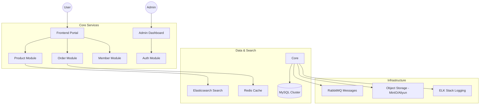
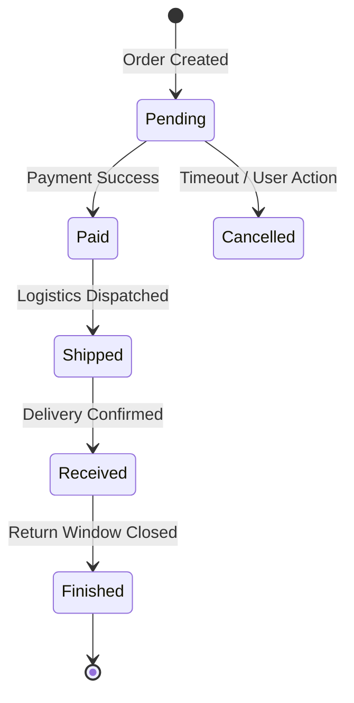

# 🛒 OmniMall: Enterprise Omnichannel E-Commerce System


OmniMall is a comprehensive e-commerce ecosystem designed for high-concurrency retail environments. Built on a modern **Spring Boot** and **MyBatis** foundation, it provides a seamless shopping experience across web and mobile platforms, integrated with advanced search, secure payments, and automated logistics.

## 🏛️ System Architecture

OmniMall uses a modular monolith approach with specialized services for high-demand operations like search and notifications.



## ⚡ Key Features

### Frontend Marketplace
- **Dynamic Discovery**: Personalized product recommendations and hot deals.
- **Advanced Search**: Lightning-fast filtering using Elasticsearch.
- **Seamless Checkout**: Robust order processing with state-machine validation.
- **Member Center**: Holistic profile management and order tracking.

### Backend Administration
- **Inventory Control**: Real-time stock management and SKU tracking.
- **Marketing Engine**: Coupon generation, flash sales, and campaign tracking.
- **Analytics**: Deep-dive reporting on sales, conversion, and user behavior.
- **Access Control**: Fine-grained RBAC (Role-Based Access Control) via Spring Security.

## 🔄 Order Processing Lifecycle



## 🛠️ Technology Stack

| Category | Technologies |
| :--- | :--- |
| **Frameworks** | Spring Boot, MyBatis, Spring Security |
| **Databases** | MySQL, Redis, MongoDB |
| **Search/Messaging** | Elasticsearch, RabbitMQ |
| **Infrastructure** | Docker, Nginx, Jenkins |
| **Frontend** | Vue.js, Element UI, uni-app (Mobile) |

## 🚀 Getting Started

### 1. Requirements
- JDK 1.8+
- MySQL 5.7+
- Redis 7.0+
- Docker & Docker Compose

### 2. Fast Track (Docker Compose)
```bash
# Build & Launch all services
docker-compose up -d
```

### 3. Access
- **Admin Panel**: `http://localhost:8080/admin/index.html`
- **API Documentation**: `http://localhost:8080/swagger-ui.html`

---
*Architected and Developed by Saanvi Rajput. A benchmark in scalable e-commerce.*
